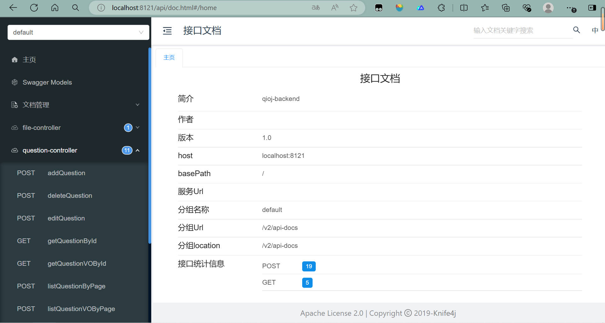

### 主流框架 & 特性

- Spring Boot 2.7.x
- Spring MVC
- MyBatis + MyBatis Plus 数据访问（开启分页）
- Spring Boot 调试工具和项目处理器
- Spring AOP 切面编程
- Spring 事务注解

### 数据存储

- MySQL 数据库
- Redis 内存数据库

### 工具类

- Hutool 工具库
- Gson 解析库
- Apache Commons Lang3 工具类
- Lombok 注解

### 业务特性

- Spring Session Redis 分布式登录
- 全局请求响应拦截器（记录日志）
- 全局异常处理器
- 自定义错误码
- 封装通用响应类
- Swagger + Knife4j 接口文档
- 自定义权限注解 + 全局校验
- 全局跨域处理
- 长整数丢失精度解决
- 多环境配置


## 业务功能

- 用户登录、注册
- 题目创建、删除、编辑、更新、数据库检索
- 题目查看、搜索
- 题目提交、判题、查看、搜索
- Java原生代码沙箱、基于docker的代码沙箱
- 黑白名单 + 字典树 + Java安全管理器和自定义Security Manager

### 单元测试

- JUnit5 单元测试
- 示例单元测试类

### 架构设计

- 合理分层


## 快速上手

> 所有需要修改的地方都标记了 `todo`，便于找到修改的位置~

### MySQL 数据库

1）修改 `application.yml` 的数据库配置：

```yml
spring:
  datasource:
    driver-class-name: com.mysql.cj.jdbc.Driver
    url: jdbc:mysql://localhost:3306/my_db
    username: root
    password: 123456
```

2）执行 `sql/create_table.sql` 中的数据库语句，自动创建库表

3）启动项目，访问 `http://localhost:8101/api/doc.html` 即可打开接口文档，不需要写前端就能在线调试接口了~



### Redis 分布式登录

1）修改 `application.yml` 的 Redis 配置：

```yml
spring:
  redis:
    database: 1
    host: localhost
    port: 6379
    timeout: 5000
    password: 123456
```

2）修改 `application.yml` 中的 session 存储方式：

```yml
spring:
  session:
    store-type: redis
```

3）移除 `MainApplication` 类开头 `@SpringBootApplication` 注解内的 exclude 参数：

修改前：

```java
@SpringBootApplication(exclude = {RedisAutoConfiguration.class})
```

修改后：


```java
@SpringBootApplication
```